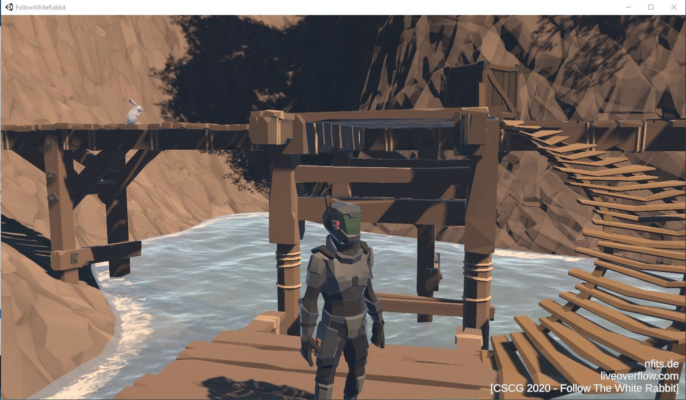

# CTF Game Challenges

I have been learning about game hacking recently and the best way I could find legally to practice is by playing [CTFs](https://ctftime.org/ctf-wtf/).  
But the difficult part is finding out the Game challenges from previous ctfs.  

This list includes game challenges I encountered while playing ctfs and reading writeups.  

Also just FYI as some of the gameservers are offline and there is no clear way to set it up or the developers have not opensourced it we can't play it now.  

## Contents

[PC Games](#pcgames)  
[Retro [Gameboy/NES]](#retro-gameboynes)  
[Android](#android)  
[Web](#web)  

---

### PC Games
  
  
1. **DragonSector CTF 2018**
	- [Arcane Sector](https://github.com/gynvael/arcanesector)

	Solution Videos  
	https://youtu.be/8bjFplctDE0  
	https://youtu.be/j0taw78tCYs  

2. **Nullcon HackIM 2020**
	- [ZeldaAdventures](https://github.com/nullcon/hackim-2020/tree/master/zelda/ZeldaAdventures)
	- [ZeldaInSpace](https://github.com/nullcon/hackim-2020/tree/master/zelda/ZeldaInSpace)  
	
	Writeups  
 	https://medium.com/@roottusk/helping-zelda-capture-flags-nullcon-hackim-2020-f2480099cc3c  
	https://devploit.dev/2020/02/09/nullconHackIM-ZeldaAdventures.html

3. **Pwn Adventure Series by Vector35**
	- [PwnAdventure Sourcery (In Browser)](https://sourcery.pwnadventure.com/)
	- [PwnAdventure 2](http://ghostintheshellcode.com/#pwnadventure2)
	- [PwnAdventure 3](http://pwnadventure.com/)

	Writeups  
	https://thekidofarcrania.gitlab.io/2018/11/18/csaw-finals-18/  
	https://www.digitaloperatives.com/2014/01/19/ghost-in-the-shellcode-2014-write-up-choose-your-pwn-adventure-2-200-portal/  
	http://lockboxx.blogspot.com/2014/01/ghost-in-shellcode-2014-ctf-writeup.html  
	https://github.com/ctfs/write-ups-2014/tree/master/ghost-in-the-shellcode-2014  
	https://x-c3ll.github.io/posts/Frida-Pwn-Adventure-3/  
	https://blog.keyidentity.com/tag/pwnadventure/  

	Solution Videos  
	https://www.youtube.com/playlist?list=PLhixgUqwRTjzzBeFSHXrw9DnQtssdAwgG  

4. **Flare-On 6 (2019)**
	- [Challenge-8 : DnsChess](http://flare-on.com/files/Flare-On6_Challenges.zip)  
	
	Writeups  
	https://www.fireeye.com/content/dam/fireeye-www/blog/pdfs/FlareOn6_Challenge4_Solution_DnsChess.pdf  
	https://0xdf.gitlab.io/flare-on-2019/dnschess.html  

5. **Insomni Hack** 
	- [Pwn Arena](https://s3-eu-west-1.amazonaws.com/insomnihack/game/Windows.zip)

	More Info :	https://www.insomnihack.ch/ctf-test-the-game/  

	Writeups  
	https://gist.github.com/bkth/f8d9965bb985af0d925352a88067b240  

6. **RiceTeaCatPanda CTF 2020**
	- [Tea Clicker](https://github.com/JEF1056/riceteacatpanda/tree/master/Tea%20Clicker%20(150))
	- [Work In Progress](https://github.com/JEF1056/riceteacatpanda/tree/master/Work%20In%20Progress%20(400))

	Writeups  
	https://blog.nlegall.fr/rtcp-tea-clicker.html  
	https://blog.nlegall.fr/rtcp-work-in-progress.html  

7. **InsomniHack 2017**
	- [FPS](https://download.scrt.ch/FPS/Windows.zip)

	Info & Writeup  
	https://blog.scrt.ch/2017/06/06/fps-write-ups-for-insomnihack-2017/   

8. **Secuinside CTF Quals 2013**
	- [game](https://docs.google.com/file/d/0Bxq9FZappPXQY1Y0VWtyMENjM3c/edit)
	
	Writeups  
	http://lockboxx.blogspot.com/2013/06/intro-to-reversing-windows-portable.html  

9. **BSidesCBR CTF 2017** 
	- Let’s Play a Game!
	- Old PC

	Writeups  
	https://codecadets.blog/bsides-canberra-lets-play-a-game-aa562be9b129  
	https://codecadets.blog/bsides-canberra-2018-ctf-write-up-old-pc-37116ab7625e/  

10. **Thotcon 0xa**
	- [quack (In Browser)](http://quake.token.wtf/)
	
	Writeups  
	https://lturner.net/blog/thotcon-0xa/  

11. **CSCG 2020**
	- [Follow The White Rabbit](https://earth.2020.cscg.de/tasks/Follow%20The%20White%20Rabbit%20-%20Cave)  
	Challs include `Cave & Datamining`  

	- [Maze](http://maze.liveoverflow.com/)  
	Challs include `Emoji, M4z3 Runn3r, Map Radar, Maze Runner, The Floor Is Lava, Tower`  

	Writeups  
	https://stygiansecurity.com/following-the-white-rabbit-in-game/  
	https://jamchamb.github.io/2020/06/21/cscg2020-maze-writeups.html  
	https://github.com/bburky/mmo-maze-frida  

12. **XMAS CTF 2019**
	- [Lapland Mission](https://drive.google.com/file/d/1pSe5wVzYU7kC69v7oFGoPT13Sm5W2PBh/view)

	Writeups  
	https://github.com/archercreat/CTF-Writeups/blob/master/X-MAS%20CTF/Lapland%20Mission/README.md  

13. **TJCTF 2020**
	- [Gamer F](https://drive.google.com/file/d/19_sHTHhQ1dmXK9zmpSCuulaBXYjwAJyw/view)
	- [Gamer R](https://drive.google.com/file/d/19cl1546hn9EymbtZg7YKBrw4u_TPDcjc/view)

	Writeups  
	https://deadlock.team/ctf/forensic/tjctf%202020/2020/05/27/TJCTF-gamerf/  
	https://deadlock.team/ctf/rev/tjctf%202020/2020/05/27/TJCTF-gamerr/  

14. **Redpwn CTF**
	- 2019
		- [MC Password Storage](https://csy54.github.io/2019/08/Writeup-RedpwnCTF/Password_Manager.zip)  
	- 2020
		- [i-wanna-find-the-flag](https://github.com/redpwn/redpwnctf-2020-challenges/tree/master/rev/i-wanna-find-the-flag)

	Writeups  
	https://ctftime.org/writeup/16176  
	https://spinstars.dev/writeups/2/  
	https://github.com/shiversoftdev/redpwn-i-wanna-find-the-flag/blob/master/README.md  

15. **Pwnium CTF 2014**
	- [Old World](https://github.com/ctfs/write-ups-2014/tree/master/pwnium-ctf-2014/old-world)

	Writeups  
	https://in3o.wordpress.com/2014/07/06/pwnium-ctf-2014-reverse-100-old-school/  

16. **Hackerearth CipherCombat 2.0**
	- [Pong](http://ge.tt/5Qka2L23)

	Writeups  
	https://s3-ap-southeast-1.amazonaws.com/he-public-data/pong-writeupd842017.pdf  

17. **HackTheVote CTF 2016**
	- [The Wall](https://github.com/RPISEC/HackTheVote/tree/master/reversing/theWall)
  
	Writeups  
	https://emanuelecozzi.net/posts/ctf/how-to-fly-with-radare2

18. **Plaid CTF 2020**
	- [Watness 2 [Mac]](https://ctf.harrisongreen.me/code/2020/plaidctf/game_cleaned.rc1)

	Writeups  
	https://ctf.harrisongreen.me/2020/plaidctf/the_watness_2/    

19. **Defcon CTF Quals 2020**
	- [Babymaze](https://github.com/TFNS/writeups/tree/master/2020-05-18-DefconQualification/babymaze)
	- Mamamaze  

20. **Flare-On 5 (2018)**
	- [Challenge2 - Ultimate Minesweeper](https://github.com/albertzsigovits/flare-on-challenges/blob/master/2018/FlareOn5_Challenges/02_UltimateMinesweeper.7z)

	Writeups  
	https://bruce30262.github.io/flare-on-challenge-2018-write-up/#level-2  
	http://justanotherdfirblog.blogspot.com/2018/10/flare-on-2018-challenge-2-ultimate.html  
	https://medium.com/@EpsilonCalculus/write-up-to-the-2018-flare-on-challenge-infosec-newbie-edition-flareon5-6444431444b4  

21. **3kCTF-2020**
	- [Game 1-2](https://drive.google.com/file/d/1VHlnOdGuoIKPer_s2AV5-tQjOzaCQlyB/)

	Writeups  
	https://tcode2k16.github.io/blog/posts/2020-07-26-3kctf-writeup/#game-1  

***
   
### Retro [Gameboy/NES]
  
  
1. **Flare-On 6 (2019)**

	- [Challenge-8 : Snake](http://flare-on.com/files/Flare-On6_Challenges.zip) 
	
	Writeups  
	https://www.fireeye.com/content/dam/fireeye-www/blog/pdfs/FlareOn6_Challenge8_Solution_SNAKE.pdf  
	https://malwareunicorn.org/workshops/flareon6_2019.html#8

2. **Square CTF 2017**
	- [gameboy](https://github.com/VoidHack/write-ups/blob/master/Square%20CTF%202017/reverse/gameboy/mission.gb)

	Writeups & other game files  
	https://github.com/VoidHack/write-ups/tree/master/Square%20CTF%202017/reverse/gameboy  

3. **Swamp CTF 2018**
	- [Ethereal Boy](https://github.com/adeebshihadeh/ctf/blob/221d5bdeed6eadb206e72f99af7954942502d196/swampctf/game.gb)
	- [Ethereal Boy Advanced](https://github.com/adeebshihadeh/ctf/blob/221d5bdeed6eadb206e72f99af7954942502d196/swampctf/game2.gb)

	Writeups  
	https://github.com/DancingSimpletons/writeups/blob/master/swampctf-2018/Etherealboy.md  

4. **UTCTF 2020**
	- [GameboyTAS](https://github.com/utisss/UTCTF-20/tree/master/gameboy-tas)

	Writeups  
	https://www.danbrodsky.me/writeups/utctf2020-gameboytas/  

5. **HITB Amsterdam CTF 2019**
	- [Eighties](https://storage.hitbctf.nl/hitb2019ams/eighties/eighties.387eb81c5c27.nes)

	Writeups  
	https://beunhazen.net/2019/05/24/hitams19-eighties-writeup.html  

6. **r2boy series**
	- 2017  
		- [Simple](https://github.com/radareorg/r2con2017/blob/master/Competitions/Crackmes/simple.gb)
		- [Harder](https://github.com/radareorg/r2con2017/blob/master/Competitions/Crackmes/harder.gb)

	- 2019  
		- [r2boy1](https://github.com/s0larpunk/ctf_challenge_writeups/blob/f4960a50fdf5446f13e4ee3131900901777e86ec/2019/ctf_solutions/radare_ctf/r2boy.gb)
		- [r2boy2](https://github.com/s0larpunk/ctf_challenge_writeups/blob/f4960a50fdf5446f13e4ee3131900901777e86ec/2019/ctf_solutions/radare_ctf/r2boy1.gb)
	
	Writeups  
	https://www.megabeets.net/reverse-engineering-a-gameboy-rom-with-radare2/  
	https://bananamafia.dev/post/r2ctf-2019/  
	https://github.com/s0larpunk/ctf_challenge_writeups/blob/f4960a50fdf5446f13e4ee3131900901777e86ec/2019/ctf_solutions/radare_ctf/radare_ctf_writeup.md  

7. **Hacklu CTF 2014**
	- [At gunpoint](https://github.com/ctfhacker/ctf-binaries/tree/master/binary-ctf/hack-lu-ctf-2014/at-gunpoint)

	Writeups  
	https://www.tasteless.eu/post/2014/10/hack-lu-ctf-2014-at-gunpoint/  
	https://w00tsec.blogspot.com/2014/10/hacklu-2014-ctf-write-up-at-gunpoint.html  
	https://radareorg.github.io/blog/posts/solving-at-gunpoint-from-hack-lu-2014-with-radare2/  

8. **CSAW CTF 2015**
	- [Hacking Time](https://github.com/osirislab/CSAW-CTF-2015-Quals/tree/master/reversing/HackingTime)
	- [PwnAdventure Z](https://github.com/Vector35/PwnAdventureZ)

	Physical Cartridge for PwnAdventure Z  
	https://shop.binary.ninja/collections/all/products/pwn-adventure-z-cartridge  

	Writeups  
	https://bruce30262.github.io/csaw-ctf-2015-hacking-time/  
	https://www.voidsecurity.in/2015/09/csaw-ctf-re200-hacking-time.html  
	https://www.hackucf.org/csaw-2015-finals-blox-pwnadventurez-re-250/    

9. **Reply CTF 2018**
	- [GOODBOY](https://challenges.reply.com/tamtamy/file/download-29827.action)

	Writeups  
	https://xz.aliyun.com/t/2858#toc-4  

10. **TUM CTF Teaser 2015**
	- [Cloud Gaming](https://2015.ctf.link/challenges/12/)

11. **Rootme**
	- [Basic GameBoy crackme](https://www.root-me.org/en/Challenges/Cracking/GB-Basic-GameBoy-crackme)

12. **44con CTF 2018**
	- [SMB](https://drive.google.com/open?id=1K2t6zyJxzCwBkdJFMWRrcenyoZl5aetx)
	
	Writeups  
	https://leigh-annegalloway.com/44con-ctf-writeup/  

13. **KipodAfterFree CTF 2020**
	- [Gamebob](https://github.com/Michaelikarasik/ctfs/tree/4a68f238edb7123522af1c7265dac89b3831c813/jeopardy/kipod_after_free/gamebob)

	Writeups  
	https://teamrocketist.github.io/2019/12/26/Reverse-Kipod2019-GameBob/  
	
14. **RCTF 2020**
	- [My Switch Game](https://adworld.xctf.org.cn/media/uploads/task/96885ee00f0a43369b656e0d1498a040.zip)

	Writeups  
	https://blog.rois.io/en/2020/rctf-2020-official-writeup-2/  

15. **CTFZone Quals 2019**
	- [M394Dr1V3 cr4cKM3](https://captf3.captf.com/2019/ctfzone/reversing/m394dr1v3-cr4ckm3/)
	
	Writeups  
	https://ptr-yudai.hatenablog.com/entry/2019/12/02/093635  

16. **HackTheBox**
	- [Nostalgia](https://www.hackthebox.eu/home/challenges/Reversing)  

	Writeups  
	https://exp111.github.io/Nostalgia/  

---

### Android
  
  
1. **Google CTF 2018**
	- [shall we play a game](https://github.com/google/google-ctf/tree/8e0f4a637d295f46ebb4a7213cdf4947b3881eec/2018/quals/re-android)

	Writeups  
	https://w0y.at/writeup/2018/07/02/google-ctf-quals-2018-shall-we-play-a-game.html  
	https://github.com/AdityaVallabh/ctf-write-ups/tree/master/Google%20CTF%202018/Shall%20We%20Play%20a%20Game%3F  

2. **Google CTF 2019**
	- [Flappy Bird](https://github.com/google/google-ctf/tree/master/2019/quals/reversing-android/attachments)

	Writeups  
	https://blog.nviso.eu/2019/07/18/solving-flaggy-bird-google-ctf-2019/  

3. **RCTF 2020**
	- [Play The Game](https://adworld.xctf.org.cn/media/uploads/task/cb3f4ef2acd145beb3f5b671fda677a2.zip)
	
	Writeups  
	https://blog.rois.io/en/2020/rctf-2020-official-writeup-2/  

4. **Defenit CTF 2020**  
	- [Catchmouse](https://drive.google.com/file/d/1AMlDm8OGFwwKk2vJYTT5W_2GqY89xMqc/view)  
	
	Writeups  
	https://github.com/TFNS/writeups/blob/master/2020-06-05-DefenitCTF/catchmouse/README.md  

---

### Web

Most of the web games are dead!   

1. **CSAW CTF Finals 2018**
	-  [Wic Wac Woe](https://github.com/osirislab/CSAW-CTF-2018-Finals/tree/a25d847da426baa6ebe54545ac540e12ab6408ee/pwn/wic_wac_woe)

	Writeups  
	https://zackorndorff.com/2018/11/13/csaw-ctf-finals-2018-wic-wac-woe-1-writeup/

2. **Plaid CTF 2019**
	- Watness  
  
	http://blog.rb-tree.xyz/2019/04/22/plaidctf-2019-the-wat-ness/  

3. **TJCTF 2020**
	- Gamer W

	https://canirudh.codes/posts/tjctf-gamerw-writeup/  

4. **Bountycon 2020**
	- Proof-of-Game

	https://kishanbagaria.com/bountycon-2020/#proof-of-game--web--published-dec-30  
	
---

## Contributing

Help me in keeping this list updated by :  

- Providing new games you encounter in ctfs to me over Twitter : [@MrT4ntr4](https://twitter.com/MrT4ntr4)
- Opening Pull Requests
